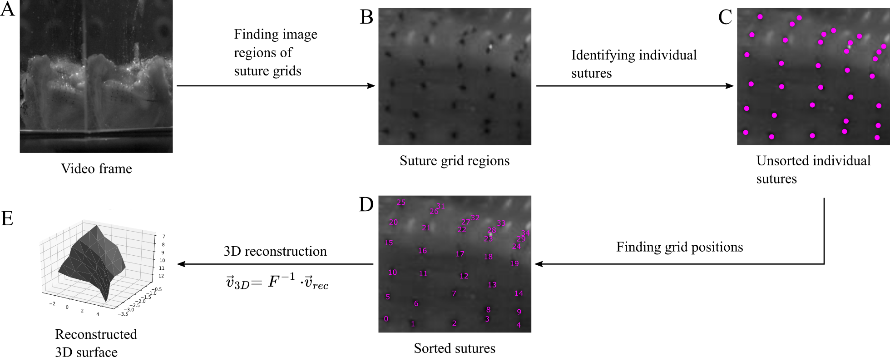
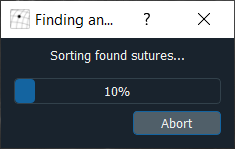
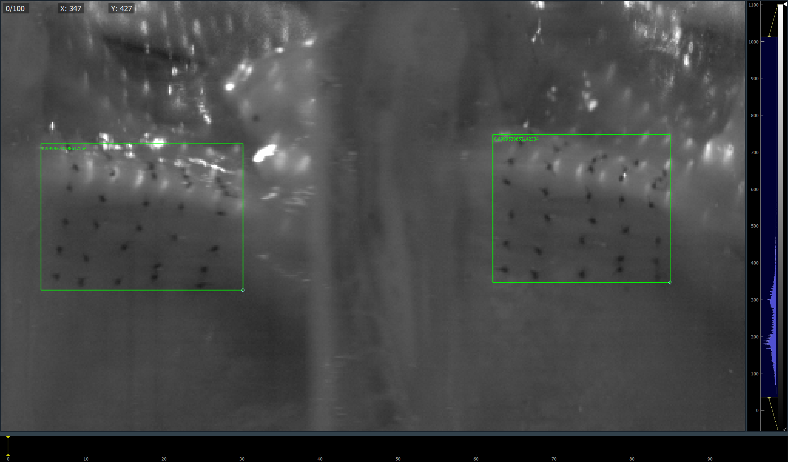
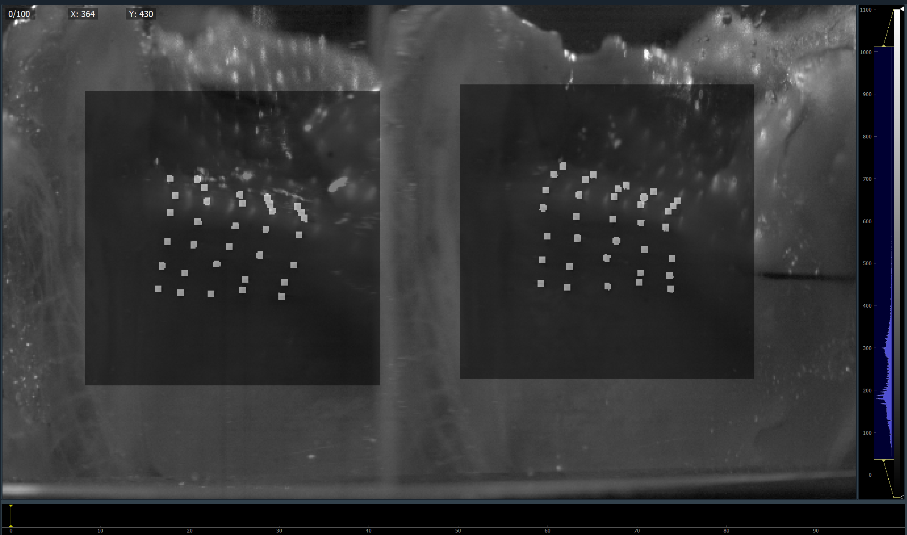
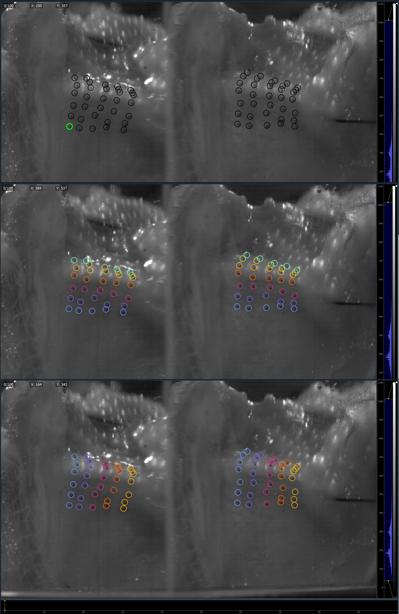

*******************
Automated Labeling
*******************
Annotations of sutures can be generated fully-automatically using deep learning methods.

**Magic -> Automated labeling** allows access to the :doc:`automation_menu` for
suture annotation.

For Micro-sutures
=================
After applying the desired automation settings, the automatic annotation process 
will try to identify each individual suture and assign it to its grid position.
The process is created as a multi-step process, breaking the task down into three
subsequent steps:
1. Finding image regions showing suture grids
2. Finding image coordinates of individual sutures
3. Assigning each suture to a grid position

The complete process including the 3D surface reconstruction is illustrated as:

Progress dialog
---------------
Running the automation process will create a progress window indicating approximately
how long the full process will take.

.. note:: Running on a CPU, annotating 2,000 frames takes approximately 2 hours 20 minutes

.. caution:: 

    The ``Abort`` button is not implemented correctly and will not abort the automation process.
    There is currently no way to cancel the process once started except for exiting the GLabel application.

Result overlays
---------------
After the automation process has finished, GLabel will display the results of the individual
inference steps.

Suture grid regions
^^^^^^^^^^^^^^^^^^^^
Found suture grid regions are displayed as bounding boxes along with confidence values.

.. note:: With default configuration, region overlays can be toggled using **P** key.

Suture segmentation
^^^^^^^^^^^^^^^^^^^^^
Results of the suture segmentation are displayed as semi-opaque overlays displaying the resulting
segmentation maps.

.. note:: With default configuration, segmentation overlays can be toggled using **O** key.

Suture Annotations
^^^^^^^^^^^^^^^^^^^
The final suture annotations after assignment to grid positions are displayed the same way
as manual annotations.
Using the **C** key, color-coding of annotations can be cycled to allow easier identification
of any occurring annotation errors.

In my evaluations the automatic annotation made 5 errors per suture grid on average.
Using the color-coding of sutures allows easy spotting of where these errors occurred.
Using **Right mouse button** on a ROI opens the context menu where a new grid position can be assigned.
Alternatively, using **Shift + Left mouse button** on a ROI or a grid position in the *GridWidget* switches the assignment of the currently active position with the clicked position.