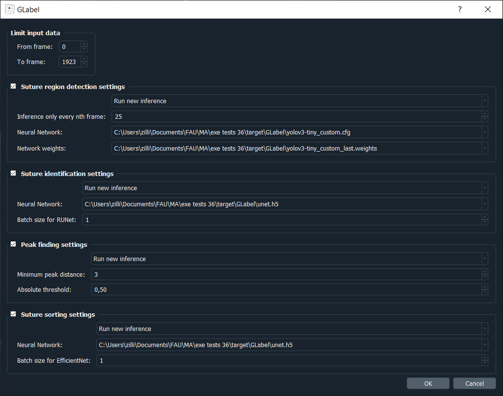

*******************
Automation Menu
*******************
Annotations of sutures can be generated fully-automatically using deep learning methods.

**Magic -> Automated labeling** allows access to the automation settings menu:

Automation settings
====================
The settings can be used to customize various aspects of the automation process, such as which
portion of the data to annotate, and which annotation steps to perform.

Each of the neural network setting groups can be set to calculate new predictions for the data,
or use an existing inference.
GLabel tries to automatically find any existing inference data for the currently opened data file
and suggests using it (It looks for an ``inference`` directory in the same folder as the data file).
If your inference data is stored somewhere else, you can manually specify the path to it.

The available setting groups are:

Limit input data
    The fields ``From frame`` and ``To frame`` limit the portion of available data that is automatically
    annotated.
    If you want to annotate a single frame only, set both fields to the same frame number.

Suture region detection settings
    Settings for finding the suture grid regions in the video frames.
    A YOLOv3 and Tiny YOLOv3 network were trained for finding suture grid regions.
    Both networks were trained using Darknet_, which requires specification of a ``.cfg`` and ``.weights``
    file for a network.
    The path to both files can be specified in these settings.

    The setting for ``Inference only every nth frame`` allows speed-up of inference by reducing the number
    of frames for which inference is performed.
    If a value *n* larger than 1 is set here, only every *nth* frame is used for suture grid region inference.
    Frames for which no inference is performed use the same inference result as the last previous
    frame for which inference was performed.
    This might reduce detection accuracy for video footage with heavily moving suture grids.

    .. _Darknet: https://github.com/AlexeyAB/darknet

Suture identification settings
    Settings for segmentation of individual sutures.
    A U-net and a recurrent U-Net were trained for segmentation of sutures.
    Both networks were trained using Tensorflow 2.1.0, which requires specification of a ``.h5`` file
    for the network architecture and weights.
    The path to the file can be specified in these settings.

    The batch size setting will modify how many suture grid regions are used for inference at once.
    Increasing this value will potentially increase inference speed and memory requirements.

Peak finding settings
    The settings for the used peak_local_max_ function of the scikit-image library turning segmentation 
    maps into discrete suture coordinates.
    Please refer to its documentation for details on the parameters.

    .. _peak_local_max: https://scikit-image.org/docs/dev/api/skimage.feature.html#skimage.feature.peak_local_max

Suture sorting settings
    Settings for assigning each suture to a grid position.
    A EfficientNetB0 was trained for the grid assignment.
    Settings are the same as for suture identification.