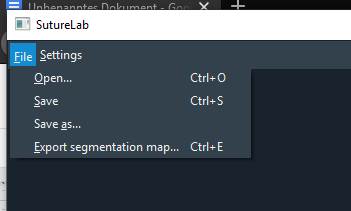

File Menu
=========

.. _file_open:

Open [Ctrl+O]
-------------
    Opens a new file to work with.

    Supported file types are:

    * .png: Loads single image.
    * .tiff: Loads single image or multi-page images as subsequent frames.
    * .mp4: Loads each frame as an image.
    * .avi: Loads each frame as an image.
    * .rois: Proprietary data format holding previously saved ROI placements (manual labels). Opening a .rois file will display the image data that was used to place the ROIs, overlayed with the placed ROI objects.
    * .h5: For loading single or multiple images or for segmentation data.
    * .npz: For loading previously saved segmentation data.

Save [Ctrl+S]
-------------
    Save and overwrite the last created .rois file with the current ROI positions. If the current ROIs have not yet been
    saved to a .rois file, the “Save as..” dialog will be opened instead.

Save as...
----------
    Saving currently placed ROI positions as a .rois file specified using a file dialog.

Export segmentaion map... [Ctrl+E]
----------------------------------
    Export a segmentation map using the currently placed ROIs as file format .h5, .npz or .tiff

    The exported segmentation map will be an empty (zeros) image with 2x2 white (255) neighborhoods at the placed ROI
    positions.