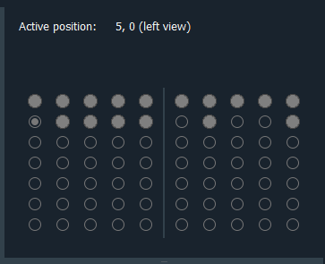
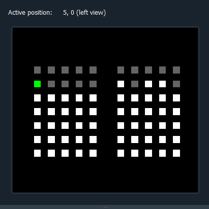

Grid Widget
===========
The Grid Widget represents the grid for which positions should be manually labeled in the image data.

It currently exists in two different stylings, one using radio buttons and the other using a pixelmap:

