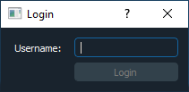
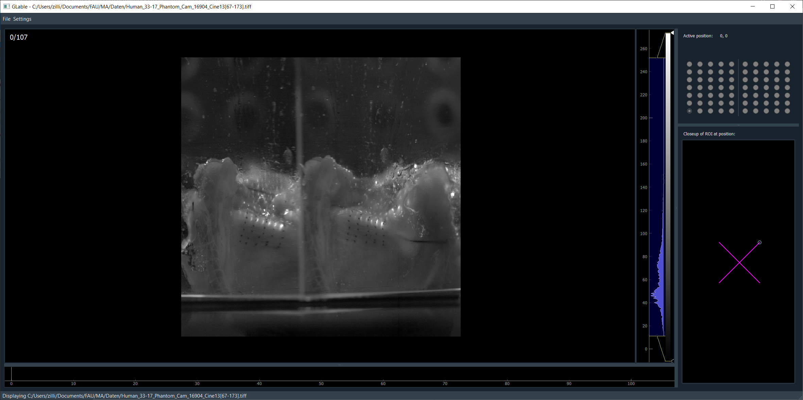

User Guide
==========
This guide will walk you through an exemplary use of the GLable GUI for manually labeling suture positions in video
data.

Startup
-------
If you are using the standalone executable version of GLabel, simply start it as a normal Windows application.

For accessing the GLabel GUI through the Python package installation, start the application by calling::

    import glabel
    glabel.run()

When starting the application, the GUI first asks the user for a login.

Login
^^^^^

The GUI will ask for a *Username* upon startup, which will only be used upon saving data as an identifier.

It does not (really) matter what username is entered, but the entered name is used in the following ways:

* Meta-information for saved manual labels in .rois format
* Identifier for user settings saved between sessions

Initial window
^^^^^^^^^^^^^^
.. image:: ../res/mainwindow.png

After entering a Username and clicking *Login* in the Login window, the GUI will open with an empty window, which will
be the main window for all further work with the tool.

Loading image data
------------------
After selecting **File -> Open** and selecting image data to be opened in the GUI, the data is loaded and (after a
loading time depending on data size) displayed along with all widgets necessary for manually labeling the data.

Supported file types can be seen here: :ref:`file_open`

List of initialized elements after data is loaded:
    * :doc:`imagestack_elem`
    * :doc:`gridwidget_elem`
    * :doc:`closeup_elem`

Manual Labeling
---------------
After the image data has been loaded and all widgets have been initialized, the data can be manually labeled. See the
section about :doc:`manual labeling <manual_labeling>` for explanations and tips on how to do so.