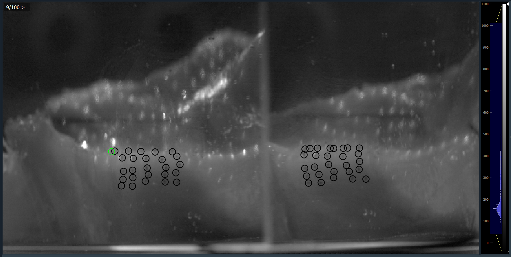

Image Stack element
=======================
The Image Stack element is the main element displaying the opened data and used for marking ROI placements.

Next to the displayed data, it provides a histogram widget for adjusting the contrast and brightness and an indicator
showing information about the currently displayed frame number.

Histogram widget
----------------
The histogram displays the distribution of values of the currently displayed image.

To adjust the contrast and brightness of the display, you can drag the yellow border lines to adjust the overall range
of displayed values, as well as drag the whole blue box to adjust the position of the windowing.

Frame indicator
---------------
The frame indicator in the top-left displays the currently displayed frame number in the form of **current frame / all
frames**.

.. note::
    The number for the current frame starts counting at 0, but the overall frame number is based on counting from 1!

    The last frame will therefore show a difference of 1 between the current and overall frames.

    This might change in the future.

It also displays a symbol hinting at the direction towards the next un-marked frame (containing no ROI placements)
using the following symbols:

* >: The first empty frame is further along the video frames.
* <: An empty frame exists on a previous frame.
* \|: The currently displayed frame is the first empty frame.