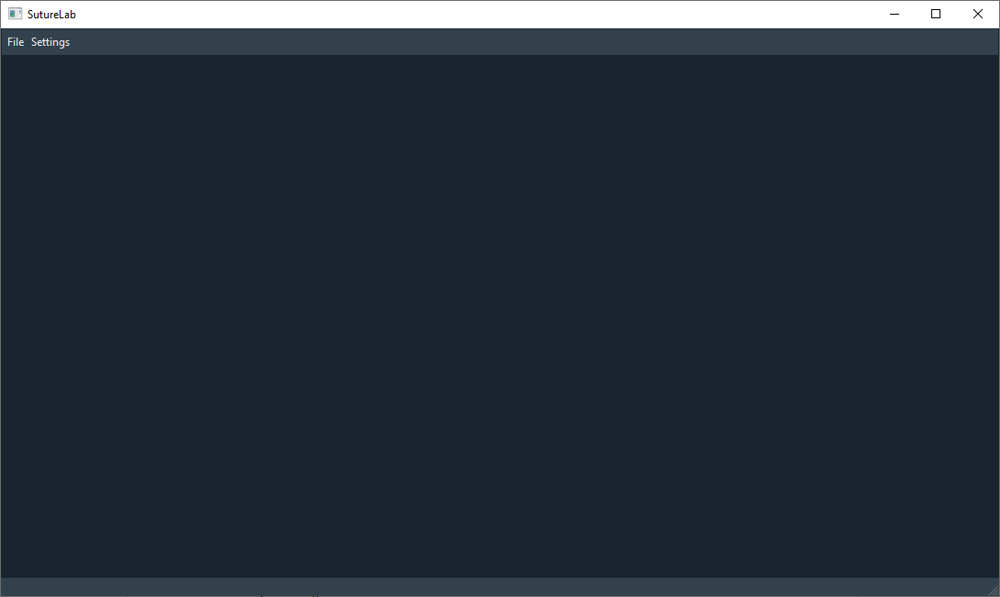

Main Window
===========

The main window is the underlying window holding all functionality of the GUI.

It will be populated by other widgets and creates dialogs as necessary.
It coordinates the communication between widgets and handles multi-threading (in case of automatic annotation via
neural networks).

