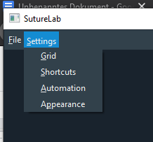
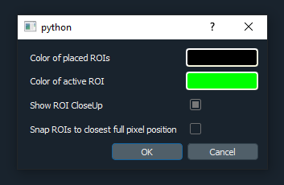

Settings Menu
=============

Grid Settings
-------------
Opens a new dialog where options regarding the grid widget can be customized.

.. image:: ../res/grid_s.png

.. caution::
    Changing any values in the grid settings and accepting the dialog will erase all currently placed ROI positions
    from the currently opened file!

    (Placed ROI positions are only valid for the grid dimensions they are placed for. Changing any grid settings
    will therefore invalidate any already placed positions and they are thus deleted.)

Customizable options are:

Number of rows
    Number of rows in the grid.
    Values have to be larger than 0!.
    Defaults is 7 rows.

Number of columns
    Number of columns in the grid.
    Values have to be larger than 0!
    Default is 5 columns.

Enable stereoscopic grid
    Enabling the stereoscopic grid doubles the column dimension of the grid in order to two identical sides
    representing two different views of the same grid objects.
    Default is a stereoscopic grid.

Shortcut Settings
-----------------
Opens a new dialog where users can customize most used keyboard shortcuts used by the GUI.

.. image:: ../res/shortcuts_s.png

Each shortcut can be customized by clicking the edit field in the left column and pressing the desired
key-combination for that shortcut (sequenced key-presses are possible).
After the '...' symbols have disappeared from the edit field, the shortcut is set.

.. note::
    User-defined shortcuts are preserved across sessions if the same Username is entered at the Login window.

Automation Settings
-------------------
Opens a new dialog where you can customize some aspects of the automation intended to support in manually
labeling data.

    .. image:: ../res/automation_s.png

Mode for automatic progression
    Allows customizing the mode of automatic progression through the grid positions.

    * Row-wise: Moving within row until end before switching to next row
    * Column-wise: Moving within column until end before switching to next column

Snaking
    Snaking mode defines how the grid positions are traversed.

    .. image:: ../res/pathing.png

Begin pathing at top-left
    By default, the pathing for the automatic progression through the grid position begins at the bottom-left,
    irregardless if the grid is progressed through row- or column-wise.

    Setting this option to be enabled, makes the pathing have its starting point at the top-left grid position instead,
    which in effect will invert the pathing shown in the image above vertically.

Enable automatic copying of ROIs to next frame if empty
    This option can be enabled if all ROIs from the current frame should be copied 1:1 to the next frame when that frame
    has not been labeled yet.

    The copying will happen at the moment of frame switch, copying all available ROI objects without any change to the
    new frame.

Mode for automatic progression of active grid position
    Lets you define the behavior for when the currently active grid position changes automatically.

    Available options are:

    On empty frame and ROI placement
        The grid position will automatically progress one position on every placement of a ROI object.

        The grid position will reset to the starting position (default bottom-left) when moving to a completely empty
        frame

    Only on empty frame
        The grid position will stay the same after placing an ROI object for the current position.

        The grid position will still reset to the starting position when moving to an empty frame

    Only on ROI placement
        The grid position will automatically change to the next grid position if a ROI was placed.

        The grid position will not change when switching to an empty frame.

    Never
        The currently active grid position will never change automatically.

        Enabling this option makes the otherwise disabled option for frame-clicking available.

Activate frame-clicking
    .. note::
        This option is only available if the *Mode for automatic progression of active grid position* is set to 'Never'!

    Activating frame-clicking makes the GUI automatically switch to the next frame after placing an ROI position. The
    currently active grid position will not change during this frame switch.

    This method of automation can be used for data where its hard to assign all positions in the image frame to their
    actual position in the grid. Tracking one position across frames makes it easier to determine the frame-to-frame
    movement of that position and not lose track of it.

Number of rows that auto-track
    This option allows you to define how many rows of the grid, counted from the bottom row, will be affected by any of
    the copy-and-track methods available. The remaining rows will be copied but placements will not be changed in any
    way.

    This option is useful for cases where some of the lower rows do not change much and are therefore easy to track,
    while higher rows may be too difficult to automatically track and it would cause more overhead work than help.

    The available copy-and-track methods are either using **Matching** mode, where template matching is used to find the
    same labeled image content after copying, or **Nearest Dark** mode, where the darkest pixel in a close neighborhood
    is set to be the new ROI position.

Appearance Settings
-------------------
Opens a new dialog where settings regarding the look and feel of the GUI can be customized.

Color of placed ROIs
    Allows you to customize the color of the circle objects marking ROI placements when they are not the currently
    active position.

Color of active ROI
    Allows you to customize the highlighting color of the circle object marking the currently active ROI position.

Show ROI closeup
    Toggle option to enable/disable the display of the closeup view of the currently active ROI position

    .. warning::
        Option is available but no logic implemented. This option will probably be removed in the future.

Snap ROIs to closest full pixel position
    Enabling this option will force all ROI objects to snap to full pixel positions when initially placed and when
    when dragged after placement

    If disabled, ROI objects can be placed at sub-pixel positions to allow for mor accurate placements.

    .. caution::
        This option does not affect the closeup view of the currently active ROI position. Due to its implementation,
        the closeup can only move by full pixel positions.

        Generally, the ROI placement on the actual frame is the definitely correct one and should be trusted in case of
        differences between it and the position in the closeup view.