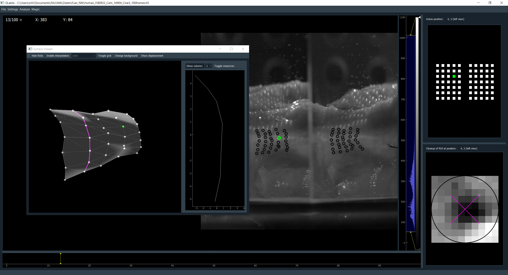

.. GLabel documentation master file, created by
   sphinx-quickstart on Fri Mar 13 12:41:25 2020.
   You can adapt this file completely to your liking, but it should at least
   contain the root `toctree` directive.

Welcome to GLabel's documentation!
==================================

GLabel is a graphical software tool intended to be used for labeling of grid-like arrangements of landmarks in image
and video data.

In its current state Glabel allows for manual, semi-automatic and full-automatic labeling of landmarks in addition to
three-dimensional reconstruction of surfaces recorded in stereo vision.

GLabel can be used as a Python package or standalone Windows executable binary, available from GitHub_.
The GitHub repo is private in its current version (v0.3.1, 06.10.2020), so you have to be added as a collaborator and install GLabel using::

   pip install git+ssh//git@github.com/tbszlg/glabel.git

.. _GitHub: https://github.com/TBSZLG/GLabel

Contents
========

.. toctree::
   :maxdepth: 3
   :caption: GUI

   gui/index

.. toctree::
   :maxdepth: 3
   :caption: Workflow

   gui/workflow

.. toctree::
    :maxdepth: 4
    :caption: API:

    api/index

Indices and tables
==================

* :ref:`genindex`
* :ref:`modindex`
* :ref:`search`

